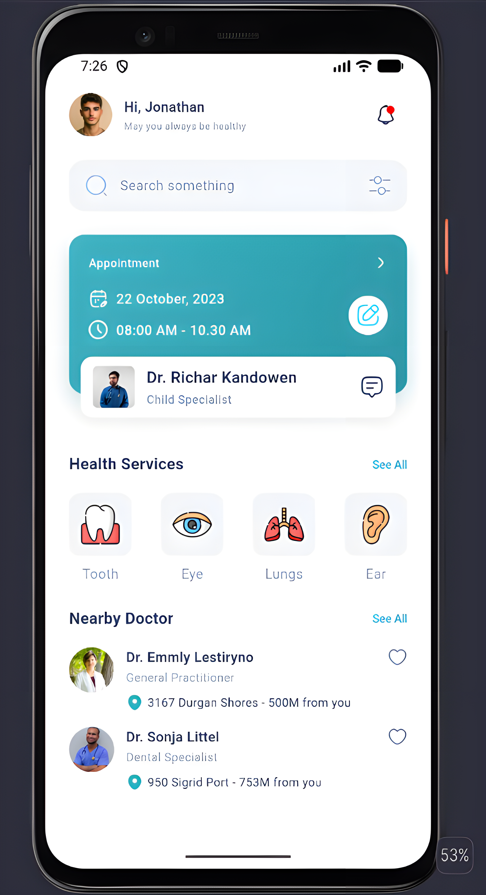
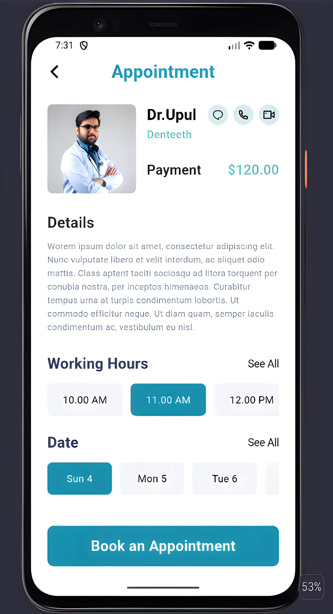

# Medical Appointment UI

<table align="center">
  <tr>
    <td align="center">
      
    </td>
    <td align="center">
      
    </td>
  </tr>
</table>

## Overview

Medical Appointment UI is a simple, cross-platform mobile application built with Flutter that
lets users browse doctors, book medical appointments, and manage their healthcare schedule.

## Features

- **Home Dashboard**: View a personalized greeting, quick search, and upcoming appointment card.
- **Health Services**: Browse health categories (Tooth, Eye, Lungs, Ear) at a glance.
- **Nearby Doctors**: Discover nearby doctors with their specialty and distance.
- **Appointment Booking**: Pick a working hour and date, then confirm a booking with a single tap.
- **Appointment Details**: View doctor info, payment summary, and contact options (chat, call, video).
- **Clean Architecture**: UI, widgets, and constants are separated into dedicated files for
  readability and maintainability.

## Technologies

- **Framework**: Flutter
- **Language**: Dart
- **UI Toolkit**: Material Design 3
- **Development Tools**: Android Studio
- **Version Control**: Git, GitHub

## Project Structure

```
lib/
├── main.dart
├── app.dart
├── core/
│   ├── constants/
│   │   ├── app_colors.dart
│   │   └── app_assets.dart
│   └── widgets/
│       └── app_image.dart
├── screens/
│   ├── home/
│   │   └── home_screen.dart
│   └── appointment/
│       └── appointment_details_screen.dart
└── widgets/
    ├── common/
    │   └── section_title.dart
    ├── home/
    │   ├── home_header.dart
    │   ├── search_bar.dart
    │   └── health_services.dart
    ├── doctor/
    │   ├── doctor_tile.dart
    │   └── nearby_doctors.dart
    └── appointment/
        ├── appointment_card.dart
        ├── appointment_header.dart
        ├── appointment_doctor_info.dart
        ├── appointment_details.dart
        ├── working_hours.dart
        ├── appointment_dates.dart
        ├── edit_button.dart
        └── book_appointment_button.dart
```

## Resources

- [Learn Flutter](https://docs.flutter.dev/get-started/learn-flutter)
- [Write your first Flutter app](https://docs.flutter.dev/get-started/codelab)
- [Flutter learning resources](https://docs.flutter.dev/reference/learning-resources)

## Installation

To install and run the application, follow these steps:

1. **Clone this repository:**
```bash
git clone https://github.com/Constantin-Stamate/medical-appointment-ui
```

2. **Navigate to the project directory:**
```bash
cd medical-appointment-ui
```

3. **Install dependencies:**
```bash
flutter pub get
```

4. **Run the application:**
```bash
flutter run
```

## Contributors

**Medical Appointment UI** was developed as part of the Mobile Application Development
laboratory works.

- GitHub: [Constantin-Stamate](https://github.com/Constantin-Stamate)
- Email: constantinstamate.r@gmail.com